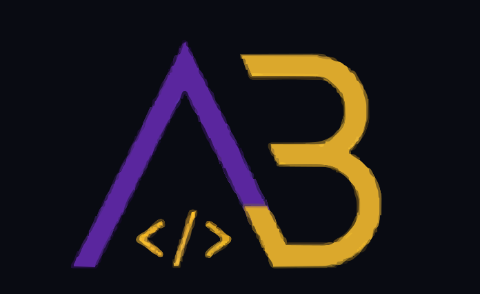

  
  
  <h1>
    
  </h1>

  

    <b>Engineering Seamless Web Experiences with an Analytical Edge</b>
  

  

    
    
  

 

## 👾 About My Engineering Journey

I am a performance-driven **Front-End Developer** who thrives at the intersection of clean architecture and intelligent data systems. My core expertise lies within the **JavaScript** and **React ecosystem**, where I focus on building responsive, bug-free, and highly optimized user interfaces.

Beyond frontend logic, I have a deep-rooted passion for **Machine Learning** and AI. I constantly explore how modern AI tools can be leveraged to write better code, automate workflows, and create smarter applications.

### ⚡ Current Focus & Activities
- 🔭 **Architecting:** Deep-diving into advanced **React patterns** and state management.
- 🌱 **Evolving:** Transitioning my codebase logic to strict **TypeScript** to ensure type safety.
- 📝 **Documenting:** Actively writing technical deep-dives and engineering articles on Medium to share knowledge and build in public.
- 💬 **Ask me about:** Clean code principles, modern JS, and integrating AI into development workflows.

> *"Whether you think you can do it or you think you can't, you're right." — Henry Ford*

 

## 🛠️ Technical Arsenal

  
<strong>Languages & Core Tech</strong>

  

 

  
<strong>Tools & Architecture</strong>

  

 
<!-- 
## 🏆 GitHub Achievements

  

 
-->

 

## 📊 Performance Metrics

  
  

 

  

 

## 🐍 Contribution Graph

  <picture>
    <source media="(prefers-color-scheme: dark)" srcset="https://raw.githubusercontent.com/alireza-baqeri/alireza-baqeri/output/github-contribution-grid-snake-dark.svg">
    <source media="(prefers-color-scheme: light)" srcset="https://raw.githubusercontent.com/alireza-baqeri/alireza-baqeri/output/github-contribution-grid-snake.svg">
    
  </picture>

 

  

---

  

